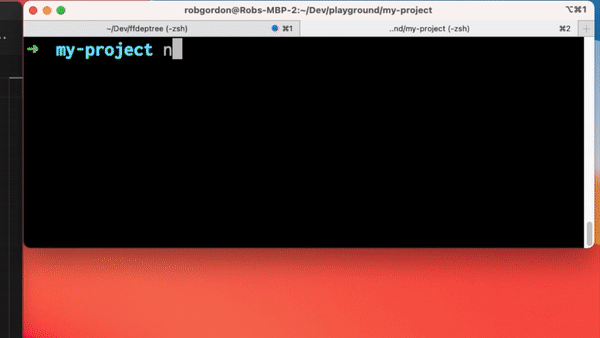

<div align="center">

# ffdeptree

<!-- prettier-ignore-start -->
[![version][version-badge]][package]
[![downloads][downloads-badge]][npmtrends]
[![MIT License][license-badge]][license]
[![PRs Welcome][prs-badge]][prs]
<!-- prettier-ignore-end -->

Visualize the structure of file imports in typescript or javascript projects with one command.



</div>

---

## How to Use

```shell
npx ffdeptree --filename src/index.ts --directory src/
```

The `--filename` and `--directory` arguments are required, where the filename is the entry file to your project and the directory is where your source code lives.

## How It Works

Uses [node-dependency-tree](https://github.com/dependents/node-dependency-tree) to parse the files and create the graph, and [flowchart-fun](https://flowchart.fun/) to make the visualization.

## API

With the exception of `--watch`, `--port` and `--fullscreen`, all other arguments are passed to node-dependency-tree. You can see the arguments it accepts [here](https://github.com/dependents/node-dependency-tree#usage).

| Argument     | Value              | Description                                             |
| ------------ | ------------------ | ------------------------------------------------------- |
| --watch      | 0 or 1 (default 0) | Whether to watch files and sync changes in browser      |
| --port       | (default 3040)     | Which port to use in watch mode                         |
| --fullscreen | 0 or 1 (default 1) | Whether to show visualization using full browser window |

<!-- prettier-ignore-start -->
[coverage]: https://codecov.io/github/tone-row/ffdeptree
[version-badge]: https://img.shields.io/npm/v/ffdeptree.svg?style=flat-square
[package]: https://www.npmjs.com/package/ffdeptree
[downloads-badge]: https://img.shields.io/npm/dm/ffdeptree.svg?style=flat-square
[npmtrends]: https://www.npmtrends.com/ffdeptree
[license-badge]: https://img.shields.io/npm/l/ffdeptree.svg?style=flat-square
[license]: https://github.com/tone-row/ffdeptree/blob/main/LICENSE
[prs-badge]: https://img.shields.io/badge/PRs-welcome-brightgreen.svg?style=flat-square
[prs]: https://makeapullrequest.com
[coc-badge]: https://img.shields.io/badge/code%20of-conduct-ff69b4.svg?style=flat-square
[coc]: https://github.com/tone-row/ffdeptree/blob/main/CODE_OF_CONDUCT.md
[emojis]: https://github.com/all-contributors/all-contributors#emoji-key
[all-contributors]: https://github.com/all-contributors/all-contributors
[all-contributors-badge]: https://img.shields.io/github/all-contributors/tone-row/ffdeptree?color=orange&style=flat-square
[bugs]: https://github.com/tone-row/ffdeptree/issues?utf8=%E2%9C%93&q=is%3Aissue+is%3Aopen+sort%3Acreated-desc+label%3Abug
[requests]: https://github.com/tone-row/ffdeptree/issues?utf8=%E2%9C%93&q=is%3Aissue+is%3Aopen+sort%3Areactions-%2B1-desc+label%3Aenhancement
[good-first-issue]: https://github.com/tone-row/ffdeptree/issues?utf8=%E2%9C%93&q=is%3Aissue+is%3Aopen+sort%3Areactions-%2B1-desc+label%3Aenhancement+label%3A%22good+first+issue%22
[node-gyp]: https://github.com/nodejs/node-gyp#installation
<!-- prettier-ignore-end -->
